# Sprite Style Exploration

Squad rebuilt from the new reference — **matte-black hard-shell armor with gold double-headed eagle emblem**, desert-tan underlayer, brown fur mantles (scout-varies), modern tactical helmets, realistic AR-platform weapons. Elite imperial desert commandos vibe.

---

## Desert Scout Unit (Eagle Corps)

### Ranger · Kestrel — Runeweave Carbine (runic blue)

<p>
  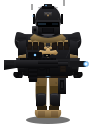
</p>

Full-face modern operator helmet: smooth black shell, visor slit with small blue sensor glow, cheek-mounted filter canister with mouth-vent grille, NVG mount up top, side antenna rails, gold-eagle helmet patch on the forehead. Segmented black chest plate with gold double-eagle emblem, tan chest-rig webbing with mag pouches, black pauldrons with gold sigil medallions. Modern suppressed carbine.

### Warden · Brannock — Dragonmaw Autocannon (draconic orange)

<p>
  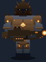
</p>

Curved full-face knight-helm with pointed crown and engraved gold crown ornament on the forehead; narrow visor slit with draconic-orange glow; cheek guard plates; mouth-vent. Oversized glossy pauldrons with gold eagle medallions. Massive segmented abdominal plate, large gold eagle front-and-center, hanging dark tabard with big eagle crest. Belt-fed autocannon with ember muzzle.

### Mystic · Seraphine — Arclight Marksman (fae violet + runic blue)

<p>
  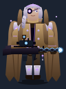
</p>

**Exposed face** — the one scout who doesn't wear a closed helmet. Desert shemagh wrapped up over the nose, sharp eyes visible above the scarf, pointed ear, goggles pushed up on the forehead (dark lenses with a violet reflection), goggle strap wrapping behind, small gold-eagle patch on the strap. Largest brown fur mantle of the squad spilling off both shoulders into a rear drape. Same matte-black plate + gold eagle beneath. Suppressed sniper with a large scope and a fae-violet lens.

### Sapper · Orin — Hexbore Scattergun (alchemical green)

<p>
  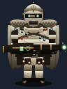
</p>

**Hawk-beak helmet** — pointed-down front snout, faceted beak ridges, wide upper visor slit with alchemical-green lens glow, respirator vent under the beak, side filter canister with hose, small gold-eagle forehead crest. Scout fur tufts on both shoulders and a rear drape, tan shotgun-shell bandolier rig on the lower chest, alchemical vial tube on the upper chest, four glowing Embercore Orbs hanging from the belt. Tactical double-barrel scattergun with green muzzle glow.

---

## Unit identity (Eagle Corps)

All four share:
- **Matte-black hard-shell plate** (`#2a2a2e` → `#0a0a0c`) with sheen highlights and segment seams
- **Gold double-headed eagle emblem** (`#e8c488` → `#8a6838`) centered on every chest, with a class-tag gem between its heads (blue/orange/violet/green)
- **Desert-tan webbing, chest rig, pants** (`#a88c5c` → `#5a4828`)
- **Light tan combat boots** with visible laces
- **Black hard-shell knee pads** over tan cargo pants
- **Gold-eagle medallion** on both pauldrons as the squad sigil
- **Modern tactical weapons** — suppressors, rail systems, optics, with a class-tag muzzle-core glow

Per-class read:

| Class  | Helmet type                 | Fur mantle                | Tag accent location                 |
|--------|-----------------------------|---------------------------|-------------------------------------|
| Ranger | Operator respirator + NVG   | None                      | Visor sensor, carbine muzzle core   |
| Warden | Curved knight helm + crown  | None (has cloth tabard)   | Visor glow, chest gem, autocannon   |
| Mystic | **Exposed face + goggles**  | **Large, both shoulders + rear drape** | Goggle lenses, chest gem, sniper scope |
| Sapper | **Hawk beak with vent**     | Small tufts + rear drape  | Goggles, chest gem, scattergun muzzle |

---

## Enemies — **The Rust Choir**

A scavenger-cult faction of goblinoid raiders clad in welded scrap. Shared visual language: orange-brown rust palette, mismatched salvaged metal plates riveted together over green skin, crude choir sigils daubed in rust-paint, and dangling bells/megaphones/horns that give them their name. Ember-lit eyes burn behind crude slits and kettle helms.

### Rust Goblin — common grunt

<p>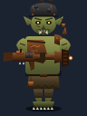</p>

Short, hunched, sickly green. Dented kettle helmet with welded horns and a dangling bell. Asymmetric scrap chest plate over bare ribs. Tattered loincloth and shin wraps, bare clawed feet. Carries a crude pipe-gun blunderbuss welded from salvaged barrels and duct tape. Single shoulder pad with a little hymn-horn. **Most encounters are goblin packs.**

### Rust Orc — rarer brute

<p>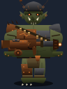</p>

Broad-shouldered moss-green bruiser. Salvaged open-face helm with big welded bull horns, dangling bell off one horn. Patchwork chest plate — rust on one side, raw sheet metal on the other — splashed with a big painted choir hymn. Jutting tusks, hooked broken nose, ember eyes. Carries a cobbled scrap assault rifle with drum magazine and duct-taped heat shroud. Usually leads a goblin squad.

### Rust Troll — rare war-priest

<p>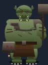</p>

Towering gray-brown hulk that fills the frame. **Full bucket helm** with narrow eye slit and red glowing eyes, huge welded bull horns with bells dangling off each, ventilation holes below the slit. Chest plates are a quilt of riveted salvage sheets with big hymn-glyphs, crossed by a **broken megaphone strapped to the torso**. Skull trophy and massive bell hang from the belt. Spiked pauldron on one side, welded door-panel on the other. Knuckle spikes welded onto massive fists. Wields a two-handed scrap heavy machine gun with belt feed and oversized heat shroud. **At most one per mission.**

---

## Tiles
<p>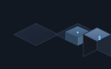</p>

---

## Maps

Every mission now rolls a random map from the pool. Two biomes at launch:

### Ruined Market *(16×12, mixed cover)*

Chaotic civilian outpost with scattered cover. `ruined_market` uses an irregular floor variant pattern so tiles don't line up. 4 player spawns along the west wall; 2 goblins, 1 orc, 1 troll scattered across the east.

```
################
#P..h......h..G#
#..H....h....H.#
#P...h....H...G#
#......hh......#
#..h........H..#
#....HH....h...#
#P.........h..T#
#..h....hh....h#
#....H.......H.#
#P..........h.O#
################
```

### Rust Chapel *(16×12, nave layout)* — NEW

Deep in Rust Choir territory. A long nave flanked by paired pillars (full cover) with two rows of pews (half cover) running down it; the troll war-priest stands at the altar steps at the far end. Regular `(x + y) % 3` floor pattern evokes aligned flagstones so it reads visually distinct from the market.

```
################
#.P.H......H.P.#
#..H........H..#
#..............#
#..hhh....hhh..#
#.G.H......H.G.#
#..hhhh..hhhh..#
#..H........H..#
#P...G.O..G...P#
#....HHHHH.....#
#....H.T.H.....#
################
```

**Roster:** 4 player spawns (2 in the entrance row, 2 in the back), **4 goblins + 1 orc + 1 troll**. Harder than the market to reflect fighting the cult on home turf. Long central aisle with cross-cover creates a classic advance-under-fire pressure — the altar is the obvious objective but the pews offer flanking routes.

---

## Next steps once you confirm the squad

1. Re-skin enemies to be visually distinct from the matte-black squad.
2. Swap the placeholder rectangles in `PixiStage.tsx` for these SVGs.
3. Add idle bob + aim-at-target variants per character.

---

<details>
<summary>Original four-way A/B/C/D comparison</summary>

### A · Pixel 16-bit
<p>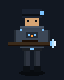 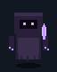 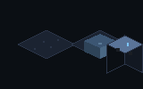</p>

### C · Painterly
<p>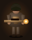  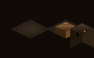</p>

### D · Noir blueprint
<p>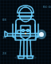 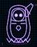 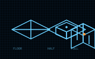</p>

</details>
