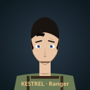
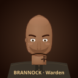
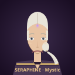
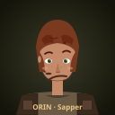

# Eagle Corps Portrait Mockups — Review

Review these mockup portraits for each of the 4 hero soldiers.  GitHub
renders SVGs inline, so each portrait should display directly below
when you open this file on GitHub. Tap / click any image to open it
full-size.

The mockups are **review art only** — they're not wired into the game.
Once you approve (or request changes to) a design, I'll push the
approved details back into the per-part rig art under
`public/styles/flat/soldiers/<name>/*.svg` so the approved look shows
up in the game's rig composition.

**How to give feedback**: reply in the chat with what to change per
soldier (e.g. "Kestrel: longer hair", "Brannock: softer mouth",
"Seraphine: no forehead rune", "approve Orin"), and I'll revise.

---

## Kestrel — Ranger

**Design notes**
- Fair skin (`#e8c4a4`), short-crop black hair (`#1a1410`) with a
  slight forehead fringe + sideburns.
- Almond-shaped blue eyes (`#4a6a9a`) with catchlights.
- Thin focused eyebrows, small nose, pressed-mouth read (scout
  concentration).
- Small scar over the right eyebrow — operator character detail.
- Olive shoulder harness (`#6a7a54`) with dark straps grounds the
  portrait.
- Blue-grey vignette background.

**Question to you**
- Hair length / style right? Any other signature features
  (tattoo, earring, goggles)?

---

## Brannock — Warden (v2)

**Design notes**
- Tan skin (`#9a6a4a`), cleanly shaved head with a natural scalp
  shine gradient (no stubble ring).
- Believable 5-o'clock shadow following the jaw line, fading toward
  the ears.
- Clean Roman nose with bridge highlight + visible nostrils (no
  broken-bend line — the v1 version had a weird diagonal bend).
- Open steady hazel eyes (`#6a4a28`) under a heavy brow ridge.
- Firm-but-composed mouth (not a grim slash).
- Scar crosses the right eyebrow (veteran detail).
- Henley collar with two visible buttons replaces the v1 stretched
  tee-scoop.
- Warm umber vignette background.

**Question to you**
- Right level of "grizzled veteran"? Want any accent like an ear
  piercing, neck tattoo, or a thicker moustache?

---

## Seraphine — Mystic

**Design notes**
- Fair skin (`#e8c4a4`), white hair (`#e8e4d8`) center-parted and
  pulled smoothly back into a long ponytail that drapes over her
  right shoulder.
- Thoughtful grey eyes (`#6a7078`) with subtle eyelash accents.
- Delicate nose + soft mouth.
- Signature **violet forehead rune** (`#c79aff`) with a glow halo —
  her mystic signature.
- Violet robe (`#4a3854`) with gold sash (`#c4a468`) and a V-neck
  showing a cream undershirt.
- Deep-purple vignette background.

**Question to you**
- Keep or drop the forehead rune? It's the most "magical" read but
  might be too on-the-nose.
- Ponytail length OK, or prefer shorter / up in a bun / loose?

---

## Orin — Sapper

**Design notes**
- Medium skin (`#c48a6a`), auburn shaggy bob (`#7a3a20`) with stray
  fringe + a visible ear peek.
- Bright green eyes (`#3a5a3a`) — alert / inquisitive read.
- Slight smirk at one corner (tinkerer personality).
- Upturned small nose.
- **Signature details**: grease smudge on the left cheek + a small
  grease mark on the forehead + freckles across the nose bridge.
- Utility vest (`#3a2a1c`) with pouches framing the chest.
- Olive-brown vignette background.

**Question to you**
- Grease smudge land? Want more / less?
- Freckles right, or drop them?
- Hair length — bob's chin-length now. Longer? Shorter?

---

## Review checklist

When you reply, use whichever shorthand's fastest:

- **Approve** — "Kestrel approved, proceed"
- **Tweak** — "Brannock: thicker neck, smaller scar"
- **Redo** — "Seraphine: start over, younger face, no rune"
- **Change identity** — "Orin is female now" / "swap Kestrel to blond" etc.

Once all four are approved I'll:
1. Port the approved details into the per-part rig SVGs at
   `public/styles/flat/soldiers/<name>/*.svg`
2. Update the no-gear reference sprites at
   `public/styles/flat/soldiers_unarmored/soldier_<name>_unarmored.svg`
3. Ship one commit that makes the in-game soldiers match the
   approved portraits.
